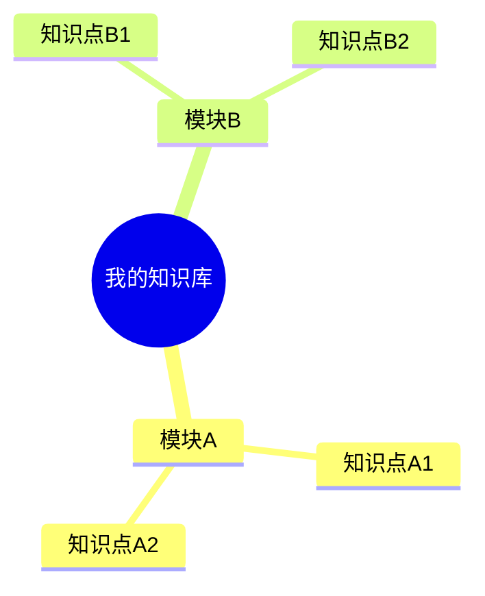

# Obsidian 目录整理与知识地图提示词

下面这段提示词可以直接复制给 AI，用来整理 Obsidian Vault。

核心原则：**先扫描、先诊断、先出方案、先让我确认；确认前不要移动、删除、重命名任何文件。**

---

## 可复制提示词

```text
你是一名 Obsidian 知识库整理顾问，请帮我整理当前 Obsidian Vault 的目录结构，并生成适合我的知识地图。

重要约束：
1. 在我明确回复“确认执行”之前，你只能扫描、分析、提出方案，不能移动、删除、重命名、合并任何文件或目录。
2. 不要直接套模板。必须先根据当前 Vault 的真实文件、目录、笔记内容和我的使用目标来判断。
3. 所有整理建议必须可解释：为什么这样分、解决什么问题、未来如何维护。
4. 默认不要删除文件。如需处理重复、过期或不确定内容，优先建议移动到 Archive，而不是删除。
5. 如果当前 Vault 已经是 Git 仓库，整理前先检查 git status；如果不是 Git 仓库，先建议我备份或初始化 Git。

请按下面流程执行。

第一阶段：扫描现状，只读分析

请先扫描当前 Vault，输出：
- 一级目录结构
- 二级目录结构
- Markdown 笔记数量
- PDF、图片、附件数量
- 根目录散落文件
- 空目录
- 重复或疑似重复文件
- 命名不一致的问题
- 当前目录像是按什么方法组织的，例如 PARA、领域分类、项目分类、课程分类、时间分类等

这一阶段只允许读取和分析，不允许修改。

第二阶段：判断目录分类原则

请先判断当前 Vault 应该采用哪种目录管理方式，不要默认机械套用 PARA。

可选分类原则包括：

1. PARA：按内容生命周期分类
   - Projects：有明确目标、截止点、交付物的项目
   - Areas：需要长期维护的责任领域或能力领域
   - Resources：外部资料、参考材料、论文、课程、书籍、工具
   - Archive：已完成、不活跃、过期但暂时保留的内容
   - 可选 Inbox：临时入口，放未整理内容
   - 可选 Attachments：图片、PDF副本、绘图、导出文件等附件

2. 单主题能力树：按一个主题的知识结构分类
   - 适合只服务一个主题的 Vault
   - 例如 AI 大模型、考研、英语学习、医学考试、法律考试
   - Vault 本身代表主题，一级目录不需要重复主题名
   - Areas 下可以按能力树、知识模块、学习路径编号

3. 多主题领域分类：按多个主题或人生领域分类
   - 适合同一个 Vault 同时管理工作、学习、生活、投资、写作等
   - 可以在 PARA 下用二级主题目录
   - 例如 Areas/工作、Areas/英语、Areas/投资

4. 项目驱动分类：按项目和产出分类
   - 适合咨询、科研、产品、工程项目、写作项目
   - Projects 是核心，Areas 和 Resources 为项目服务
   - 每个项目应有目标、过程、资料、结果、复盘

5. 课程或学习路径分类：按课程、章节、阶段分类
   - 适合学校课程、考试备考、训练营、系统课程
   - 缺点是课程结束后容易变成静态资料库
   - 建议课程结束后把长期知识沉淀到 Areas

6. 时间分类：按年份、月份、日期分类
   - 适合日记、日志、会议记录、每日复盘
   - 不适合作为长期知识库主结构
   - 可以作为 Daily Notes 或 Journal 的辅助结构

请输出：
- 当前 Vault 最像哪种分类原则
- 当前 Vault 最适合哪种分类原则
- 是否建议使用 PARA
- 如果使用 PARA，PARA 应该放在一级目录还是二级目录
- 是否应该采用“单主题 Vault + PARA + 领域能力树”
- 哪些目录应该按生命周期管理，哪些目录应该按知识结构管理

第三阶段：询问我的使用目标

请根据扫描结果，问我 3 个以内的问题，明确：
- 这个 Vault 是单主题还是多主题
- 我的身份或主要用途，例如学生、研究员、工程师、产品经理、自由职业者等
- 我希望这个 Vault 更偏学习资料库、项目工作台、输出写作库，还是长期知识系统

第四阶段：提出目录整理方案

请给出 2 到 3 个目录方案，每个方案都要说明：
- 适合什么人
- 优点
- 缺点
- 维护成本
- 是否适合当前 Vault

如果 Vault 是单主题，请优先考虑：
- Vault 本身代表主题
- 一级目录不再重复主题名
- 使用 PARA 或类似生命周期结构管理内容

如果 Vault 是多主题，请优先考虑：
- 一级目录按用途分
- 二级目录按主题分
- 避免所有内容堆在一个主题目录里

第五阶段：推荐最终结构

请基于我的目标和当前内容，推荐一个最终目录结构。

推荐结构要包含：
- 目录树
- 每个目录的用途
- 文件放置规则
- Inbox 如何清理
- Projects 如何记录项目
- Areas 如何沉淀长期知识
- Resources 如何存外部资料
- Attachments 如何放附件
- Archive 如何归档

第六阶段：生成执行计划，但不要执行

请输出一份“待执行变更清单”，包括：
- 要新建的目录
- 要重命名的目录
- 要移动的文件
- 要归档的文件
- 暂时不处理的文件
- 有风险或需要我确认的文件

请用表格展示：

| 类型 | 当前路径 | 目标路径 | 原因 | 风险 |

然后停止，等待我确认。

只有当我明确回复：

确认执行

你才可以开始整理文件。

第七阶段：确认后执行

在我确认后，请按执行计划整理目录。

执行要求：
- 每一步都尽量小范围操作
- 不要删除文件
- 如果遇到同名文件冲突，停止并问我
- 整理后再次扫描目录结构
- 输出整理前后对比
- 输出仍需人工判断的问题

第八阶段：生成目录说明文档

整理完成后，请在 Vault 根目录生成或更新：

目录说明.md

内容包括：
- 当前 Vault 定位
- 当前目录树
- 每个目录的用途
- 文件放置规则
- 日常维护流程
- 哪些内容应该进 Inbox、Projects、Areas、Resources、Attachments、Archive

第九阶段：生成知识地图

请基于整理后的目录和笔记内容，生成知识地图。

知识地图目标：
- 帮我快速知道这个 Vault 里有什么
- 帮我找到下一步应该学习、整理或输出什么
- 帮我把孤立笔记连接到长期知识体系中

请先输出知识地图草案，等待我确认，不要直接生成最终文件。

知识地图草案应包括：
- 核心主题
- 一级知识模块
- 二级知识点
- 已有笔记链接
- 缺失但重要的知识点
- 推荐学习路径
- 推荐输出路径

请优先使用 Obsidian 友好的 Markdown 形式，例如：

# 知识地图

## 1. 总览



## 2. 核心模块

- [[模块A]]
- [[模块B]]
- [[模块C]]

## 3. 学习路径

1. 基础概念
2. 核心原理
3. 实践项目
4. 复盘输出

## 4. 当前缺口

| 缺口 | 为什么重要 | 建议补充位置 |

## 5. 项目连接

| 项目 | 关联知识 | 产出物 | 复盘 |

如果我的 Vault 启用了 Obsidian Canvas，并且我明确要求生成 Canvas，请再生成：

00-总览/知识地图.canvas

否则默认只生成：

00-总览/知识地图.md

知识地图生成规则：
1. 不要只画漂亮图，要能指导学习和整理。
2. 优先链接已有笔记，用 Obsidian 双链格式，例如 [[笔记名]]。
3. 对没有笔记但重要的知识点，用“待补充”标记。
4. 不要把所有文件机械堆进地图，只放核心概念、主线和关键笔记。
5. 知识地图应分成三层：总览层、模块层、行动层。

第十阶段：确认后生成知识地图文件

当我确认知识地图草案后，再创建或更新：

00-总览/知识地图.md

如果没有 00-总览 目录，请先问我是否创建。

最终输出：
- 整理后的目录树
- 目录说明文档路径
- 知识地图文档路径
- 尚未处理的问题
- 后续维护建议
```

---

## 使用建议

朋友使用时，建议先告诉 AI：

```text
这是我的 Obsidian Vault，请先只扫描和诊断。确认前不要改动任何文件。
```

然后再粘贴上面的完整提示词。

## 当前方法说明

这套提示词参考的整理方式是：

```text
单主题 Vault + PARA + 领域能力树 + 知识地图
```

它不是纯 PARA。更准确地说：

```text
PARA 管内容生命周期，Areas 管知识体系，Resources 管外部资料，Projects 管实践产出，知识地图管全局导航。
```

含义：

- 单主题 Vault：整个 Vault 只服务一个主主题，根目录不再重复主题名。
- PARA：一级目录按内容生命周期和用途管理。
- 领域能力树：`Areas/` 内部按长期能力模块组织。
- 知识地图：在 `00-总览/` 中建立全局导航，连接核心模块、已有笔记、缺失知识点和项目产出。

## 文件目录分类原则

整理 Obsidian 时，先判断“这个文件为什么存在”，再决定放哪里。

### 按生命周期分类

适合一级目录：

```text
Inbox/
Projects/
Areas/
Resources/
Archive/
```

判断标准：

- 还没想清楚：放 `Inbox/`
- 有明确目标和交付物：放 `Projects/`
- 需要长期维护和复用：放 `Areas/`
- 外部资料和参考材料：放 `Resources/`
- 已完成或不活跃：放 `Archive/`

### 按知识结构分类

适合放在 `Areas/` 内部。

例如大模型方向：

```text
Areas/
├── 00-总览/
├── 01-数学与机器学习基础/
├── 02-深度学习基础/
├── 03-Transformer与LLM/
├── 04-预训练与数据/
├── 05-微调与对齐/
├── 06-RAG与检索/
├── 07-Agent与工具调用/
├── 08-推理与部署/
├── 09-分布式训练与系统/
├── 10-评测与安全/
├── 11-论文精读/
└── 12-面试与工程经验/
```

### 按资料类型分类

适合放在 `Resources/` 内部。

```text
Resources/
├── Papers/
├── Courses/
├── Books/
├── Tools/
└── Datasets/
```

资料类型分类只适合管理外部资料，不适合作为整个 Vault 的主结构。否则容易变成“文件仓库”，而不是知识系统。

### 按项目分类

适合放在 `Projects/` 内部。

```text
Projects/
├── RAG项目/
├── 微调项目/
├── Agent项目/
└── 推理优化项目/
```

每个项目建议包含：

```text
README.md
实验记录/
数据说明.md
代码链接.md
评测结果.md
复盘.md
```

### 按时间分类

适合日志，不适合长期知识主目录。

```text
Daily/
Journal/
Meetings/
```

时间分类适合记录“什么时候发生”，但不适合回答“这条知识属于什么体系”。

如果他们的 Vault 只服务一个主题，比如“考研”“AI 大模型”“英语学习”，通常适合：

```text
单主题 Vault + PARA + 领域能力树
```

如果他们的 Vault 同时管理学习、工作、生活、投资、写作等多个领域，通常适合：

```text
多主题 Vault + PARA + 主题二级目录
```

## 推荐知识地图文件

默认建议生成：

```text
00-总览/知识地图.md
```

如果是单主题 Vault，也可以改成更具体的名字：

```text
00-总览/AI大模型知识地图.md
00-总览/英语学习知识地图.md
00-总览/考研知识地图.md
```

知识地图不要替代目录结构。目录负责“放在哪里”，知识地图负责“怎么理解和怎么走下一步”。
